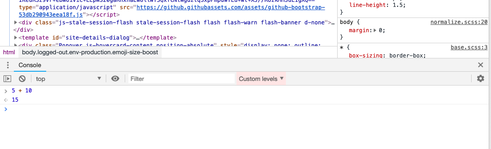
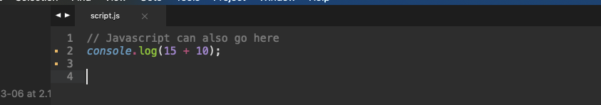
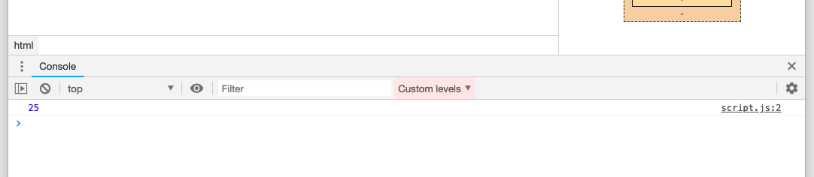

# Part 1: Intro to Javascript, D3

### Intro to Javascript
Javascript is one of the three core technologies on the internet, along with HTML and CSS. It is run in the browser and is primarily used for adding, removing and interacting with elements on a page. In contrast, HTML are the elements on the page, while CSS is used to style these elements.

Javascript is typically stored in .js files. It can also be written in html pages. But generally, you want to keep your javascript in one or several .js files, especially as your code gets more complicated.

In this example, we've created an index.html page and a script.js file, which you can use to write your javascript code. You will need to open up the index.html file in a browser, as well as that browser's developer tools. Here's more information on the dev tools for [Chrome](https://developer.chrome.com/devtools) and [Firefox](https://developer.mozilla.org/en-US/docs/Tools).

The easiest way to open your developer tools is right click on any element on any page and click "Inspect" (or "Inspect Element" depending on your browser).

### 1. Comments, console.log
* Comments allow you to write notes for your future self so you know what certain pieces of code are supposed to do. The script.js file already includes a comment.
* Console.log statements are great for debugging code. Whatever is inside of the console.log statement will be shown in your browser's dev tools.
```javascript
// Example of a comment

// Example of a console.log
console.log(5 + 10);
```

As you work through this exercise, you can type out the lines of code in your dev tool's console panel and press "Enter". When you do this, you will see the code being ran directly in the browser's console.



Alternatively, you can type these lines in your script.js file. If you do this, you will need to wrap them in a console.log statement to have the code shown to you in the browser's console.



If you go this route, you'll need to make sure your index.html file is open in a browser, as well as the dev tools. The index.html file links to the script.js file where you typed your code. Because of this, you should see the result of that console.log statement returned within the console panel.



### 2. Math, Dates
* The most basic thing you can do in javascript is math.
```javascript
5 + 10  // returns 15
10 / 5  // returns 2
10 * 5  // returns 50

Math.round(10.7);   // returns 11
Math.max(0, 150, 30, 20, -8, -200); // returns 150
Math.floor(4.7);    // returns 4
```

If you want to wrap these in console.log statements in your script.js file, it would look like so:

```javascript
console.log(5 + 10);
console.log(10 / 5);
console.log(10 * 5);

console.log( Math.round(10.7) );
console.log(Math.max(0, 150, 30, 20, -8, -200) );
console.log( Math.floor(4.7) );
```

### 3. Numbers, strings and variables
* Variables allow you store pieces of information to use later in your javascript file.
```javascript
var number = 5 + 10; // This is a number
var string = 'All hail Javascript'; // This is a string

number // returns 15
string // returns 'All hail Javascript'

number += 15;
number // returns 30

string += ', the best programming language ever'; // This will return 'All hail Javascript, the best programming language ever'
```

Remember that console.log statements are basically notes to yourself. You don't need console log statements to create and change variables, for instance, but if you want them to show up in your browser's console, you can wrap the variable name in a console.log statement like so:

```javascript
console.log(number);
console.log(string);
```

### 4. Data type: Arrays
* You can group numbers and strings into one variable using arrays.
```javascript
var array_one = [10, 15, 20]; // Arrays are groups of numbers

// Array indexes start with zero
// To get the first attribute in this array do the following:
array_one[0] // returns 10

array_one[1] // returns 15
array_one[2] // returns 20

var array_two = ["String one", "string two", "Guess what? This is another string"];

array_two[0] // returns "String one"
array_two[1] // returns "string two"
array_two[2] // returns "Guess what? This is another string"

// Strings and a integer in this array
var array_three = ["Prince", "Sign o' the Times", 5];

array_three[1] // returns "Sign o' the Times"
```

### 5. Data type: Objects
* You can also store data using named attributes. These are called objects.
```javascript
var object_one = {
  "artist": "Prince",
  "album": "Sign o' the Times",
  "stars": 5
};

object_one["artist"] // returns 'Prince'
object_one["album"] // returns "Sign o' the Times"
object_one["stars"] // returns 5
```

### 6. Objects inside an array
* You can also store objects inside arrays. You can store as many as you want.
```javascript
var array_object = [{
  "artist": "Prince",
  "album": "Sign o' the Times",
  "stars": 5
},{
  "artist": "Funkadelic",
  "album": "Cosmic Slop",
  "stars": 5
}];

array_object[0]["artist"] // returns "Prince"
array_object[1]["artist"] // returns "Funkadelic"
```

Understanding data types is very important as you work with D3. Often times, your data will look like objects inside of an array. For instance, if you're working with a CSV file, D3 will convert it into an array with each row in the spreadsheet being it's own object inside of that array.

### 7. If, else statements
* This will run certain pieces of code based on a condition or conditions. Code that doesn't fit this condition or conditions will be ignored. These always end in an else statement, which is ran if none of the conditions are met.
```javascript
var number = 50;

if (number === 50) {
  // This code WILL run because the condition above is true
  console.log(number);
} else {
  // This code WILL NOT be run
}
```

* If you want to add more than one condition, you can add add the other conditions with 'else if' statements. In the example below, we'd added a second condition and it's not called because the number variable is not greater than 100.
```javascript
var number = 50;

if (number === 50) {
  // This code WILL run because the condition above is true
  console.log(number);
} else if (number > 100) {
  // This code WILL NOT be run
} else {
  // This code WILL also NOT be run
}
```

### 8. Functions
* You can also encapsulate pieces of code inside a function. This gives you the flexibility to call a function whenever you want.
```javascript
var number = 50;

function addFifty() {
  // This operation is ran because the function was called below
  number + 50

  // This will return 100
  console.log(number);
};

// This calls the function
addFifty();
```

### 9. For loops
* If we want a piece a code to run many times, we can call a for loop. Inside a for loop, you can decide what number to start with and how many times you want the loop to be ran.
* This for loop starts with the number 0 and increases every time through. As long as the number is below the number 10, the loop will be ran. Therefore, the loop will be ran a total of 10 times, and the last number to be ran will be 9. The loop will stop at 9 because we set the criteria that numbers must be under 10 to be ran.
```javascript
for (var num = 0; num < 10; num++) {
  // The first time through num equals 0.
  // The second time it equals 1, etc. until we get to 9.
  // Which will be the last iteration of this for loop
  console.log(num);
}
```

### 10. Combining it all: variables, functions and for loops
* We can also create a for loop to call a function every time it loops through. This looks like so:
```javascript
var number = 50;

function plusFive(num) {
  number += 5
};

for (var num = 0; num < 10; num++) {
  plusFive()
}

// After the for loop is done
// number will equal 100
// Because the for loop was called 10 times
// And each time 5 was added to its initial value of 50
console.log(number);
```

### A note about semicolons
* You will note that statements have semicolons at the end of them. While your browser will still run if you don't include them, it's best practice to include them. Here's a [great guide](https://news.codecademy.com/your-guide-to-semicolons-in-javascript/) to help you further.

### Intro to D3
After you have the basics of javascript down, you can start using javascript libraries, which are written and maintained by other javascript developers. Libraries are separate .js files that you will need to link to in your index.html file. You can do this by downloading the file or linking to the location of the file on the internet. Often, libraries are created to make it easier to do things in javascript that would otherwise be complicated and/or tedious to do without them. There are [many, many libraries](https://en.wikipedia.org/wiki/List_of_JavaScript_libraries) available to you that serve a ton of different purposes.

D3 is a javascript library that is designed to work with data, whether it be objects like those shown in the example above or CSV files. One common use of D3 is to create charts using data.

With D3, you can use data to create and manipulate HTML elements. For instance, if you're working with a spreadsheet, you could create a DIV for each row in your spreadsheet. You could then change how that DIV looks based on the data in that row. This is, generally speaking, how many charts are made.

In this directory is a file named iowa-electricity-renewables.csv, which shows how much of the energy consumed by Iowa residents was from renewable sources. It's broken down by year and as you can see, the use of renewable sources has gone up from 2001 to 2017. With D3, we could create a bar for every year in this spreadsheet, and the length of the bar would represent how much renewable energy was used in that year. We will do exactly this in part two and three of the course.

Most commonly, D3 is used to work with SVGs instead of DIVs. Scalable vector graphics (SVG) is a markup language used to render graphics, and they have a lot more flexibility when it comes to building charts. Like DIVs, you can include SVGs within the body tag inside your index.html file. We will discuss SVGs in the second part of this course.

### 1. Examples using D3

* [Number of unaccompanied migrant children held in Texas](https://apps.texastribune.org/features/2018/texas-migrant-children-shelters/)
* [How to know if you’re spending too much on housing in Texas](https://apps.texastribune.org/features/2018/housing-costs-texas-are-you-spending-too-much/)
* [Terror’s daily reality](https://www.latimes.com/projects/la-fg-worldwide-terror-graphic/)
* [Meet the team: LeBron and the Lakers](https://www.latimes.com/projects/la-sp-lakers-roster/?lebron-james)


