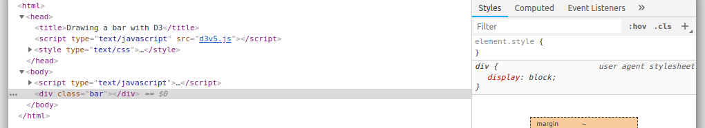
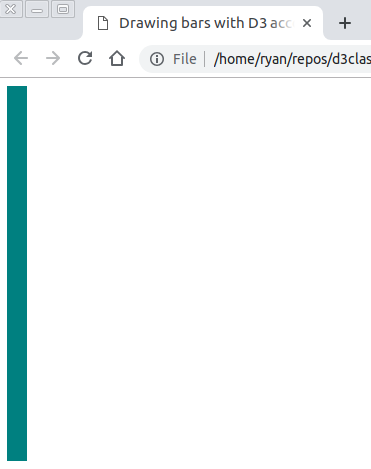
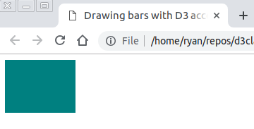
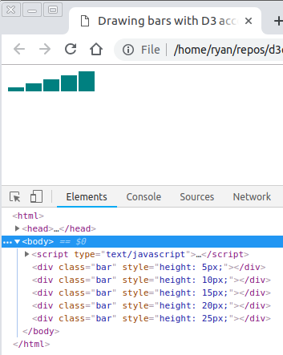
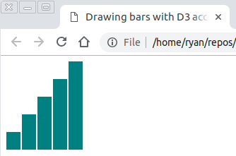
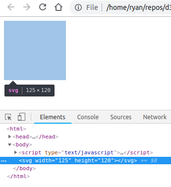

# Part 2: Diving into D3

*Portions of this class were inspired by the approach taken in the book [Interactive Data Visualization for the Web: An Introduction to Designing with D3](https://alignedleft.com/work/d3-book-2e) by Scott Murray (2nd edition).*

## What are we doing here?

You may have produced a chart in the past, using a tool such as Excel, python or R. D3, the backbone of some of the most impressive visualizations on the web today, is **not** a charting library. But it gives us some handy tools to let data become embedded in the browser, which can then render the pieces that build up to a chart.

Today, we're going to focus on the fundamentals of D3.

Our data visualization of choice will be the bar chart. We'll build one bar, then a few more, and then add some dressing to create a production-level graphic.

We are going start with empty text files for each part of the tutorial. For reference, the `final-charts/` folder contains the end results. Think of it as the answer sheet of a quiz. Feel free to ask questions along the way, and take a look at the final charts as needed.

To understand the process of D3, it helps to take a step back from javascript. We'll start by working with only HTML and CSS.

## Drawing a bar

Let's start a sketch. Navigate to the folder `02-diving-into-d3/` (the same folder where this readme.md file is located) and create a new text file. Start by saving it with a name such as `chart1.html`.

Copy and paste this basic HTML template into the page:

```html
<html>
    <head>
        <style type="text/css">
            <!-- CSS styles go here -->
        </style>
    </head>
    <body>
        <!-- HTML elements go here -->
        <script type="text/javascript">
            <!-- javascript goes here -->
        </script>
    </body>
</html>
```

A bar is just a rectangle, and the easiest way to draw a rectangle is with a `div` tag. Divs are a flexible HTML element. They can be used as containers to group sections of code, or be elements on their own. You can put one on the page by typing `<div></div>` in the body of the code. Save the text file, then open the page in your browser. It should be an empty page.

Let's tell the browser we want to make this div look like a rectangle. This is possible by adding styles to the element, such as a narrow width and a tall height for a vertically oriented bar. By default the bar will appear white, which means we won't see it on the white background. Let's add a color by modifying the div's background color property. HTML supports [more than 150 colors by named reference](https://htmlcolorcodes.com/color-names/). Pick your favorite. We are going to use teal.

Style declarations can go right on the initialization of the div. Here's what you should end up with:

```html
<div style="width:20px; height:75px; background-color:teal"></div>
```

Save the text file and refresh the browser. (Get used to doing this a lot.) Boom. You have a solitary bar.

### Styling with CSS

Declarations of style be written onto the opening of any HTML tag. But in long files, it becomes cumbersome to repeat style declarations over and over again in HTML files.

That's where Cascading Style Sheets, or CSS, comes in. CSS allows you to separate the writing of the styles from the writing of the HTML. This is handy because, for one, each is written in a completely different syntax. It also allows for more efficient and less repetitive code. By assigning names to certain HTML elements, we can then use CSS to add style to anything with a particular name.

Here's what we'll do to separate the style from the HTML in this example. Start by giving the div a name, or what HTML calls a **class**. We've gone with "bar" for the class. All you need to do is put `class="bar"` alongside the style declaration.

Now let's move the styling code into the `<style>` tag at the top of the file. We first have to refer to what we're styling. In this case, `div.bar` refers to the div with the class bar. Classes are referred to using a period (`.bar` in this case). HTML tags like `<div>` stand alone.

Then, add a couple of curly brackets with space in between after the declaration, and move the styles we wrote on the div into there. You should end up with this:

```css
div.bar {
    width: 20px;
    height: 75px;
    background-color: teal;
}
```

Now strip off the styles from the div, leaving only `<div class="bar"></div>`. Refresh the page. It should look identical to what we had before. Same bar, two different ways to get there.

## Drawing a bar with D3

Now we'll introduce another way to get the same bar by using D3.

Make a new file, something like `chart2.html`, and paste the template from above into it.

### Importing D3

We are going to include D3 as a separate javascript file, just like the `script.js` file from part one of this tutorial. We've gone ahead and added `d3v5.js` to this folder for ease of import. It contains version 5.7.0 of the library. Add it to your HTML file by putting the following line into the head of the page: `<script src="d3v5.js"></script>`

This is the full file, which comes in at about 500 kilobytes. If file sizes are a concern for you, the minified file contains identical code and takes up about half the space. You can even choose to import the web version of the [full](https://d3js.org/d3.v5.js) or [minified](https://d3js.org/d3.v5.min.js) file.

The full functionality of the D3 library is now available to us.

### Appending elements

D3 works by by injecting HTML code into the browser. To do this, you use D3 to point to an element, then specify what you want to **append** inside the element. It operates very literally.

We need to get a `div` with the class `bar` into the `<body>` tag. Here's how D3 does that:

```javascript
d3.select("body").append('div').attr('class','bar')
```

Plug that line of code into the space for javascript in the template, then open the browser to the HTML file. A blank page should appear. But crack open the inspector and check out the elements on the page.



Here's what D3 did: It grabbed onto the `<body>` tag, added a `<div>` tag inside it and then added the attribute `class="bar"` to the div. The page is identical to our text file, except for the new div inserted at the bottom. It's important to remember: With an append, D3 will always add things to the *bottom* of the element you select, after the items that already exist. That's why our div went below the `<script>` tag.

But the bar doesn't have any style. So copy and paste the style declaration from the previous example, and place it in the code. Now you have the same bar as before.

## Drawing bars based on data

Our first example created a single bar. Now we'll create multiple bars using some data.

Create a new file -- `chart3.html` -- with the same shell as before. Start by throwing the D3 into the head (`<script src="d3v5.js"></script>`) then go ahead and copy and paste the CSS from the previous example.

We'll start by creating an array in the script tag at the bottom. You can create any kind of array you want, with any numbers. We're going to use this:

```javascript
var dataset = [ 5, 10, 15, 20, 25 ];
```

Our goal is to create a bar chart, with heights corresponding to numbers in the array. Previously, we used CSS to define the height of a single bar. It follows that you could repeatedly type that to create bars of different heights. D3 will do that succinctly.

The code required may not make sense at first. Plug this into the bottom script tag before we break it down line by line.

```javascript
d3.select("body")
    .selectAll("div")
        .data(dataset)
        .enter()
        .append("div")
            .attr("class", "bar")
```

Here's what's going on:

`d3.select("body")` Just as before, we need to make a selection that identifies where we're going to place the elements we are about to create.

`.selectAll("div")` This is selecting all div items that are within the body tag. You might think "There are no divs within the body" and you would be right. However, selecting items that are about to be created is a convention D3.

`.data(dataset)` We are now making our small data set available to D3.

`.enter()` Perhaps the most crucial step in this process. By using enter, we have now gained the ability to add items repeatedly the page. Anything we ask D3 to do after this will be repeated N times, where N is the number of items in the array (in our case, five times). It also preserves the *values* of the array for use later. This is what is D3 officially refers to as *binding* data to the page.

`.append("div")` Here's where we append a div just as before. But now, this append step is going to be run five times.

`.attr("class", "bar")` Just as before, we need to add the `bar` class to the div so the styles written in the CSS can take effect. Except now, this is running on each of the five divs. This also raises a peculiarity of D3 that is worth remembering: Any maniuplation only takes effect on the *last* thing that has been selected or appended. Just like the `selectAll` only worked on the body, and the `append` worked on the just-created div, this class assignment will work on the newest divs.

What you should see in the browser is a much longer bar than the single bar from before. There are five divs (run the inspector and you'll see them), but HTML defaults to stacking divs on top of each other. Each div was given a height of 75 pixels by the CSS, so this is a bar that is 375 pixels (5*75) long.



More accurately, a div has a default CSS property called `display`, which defaults to the setting `block`. We can override it in CSS to get the bars lined up horizontally. In the `div.bar` declaration, add `display:inline-block` and refresh the page.



Getting closer. Now the bars are bunched together. Some space between them would be nice. This is easy: tack on `margin-right:2px` to the CSS to give the bars some breathing room.

What about heights based on the data values? That requires setting the CSS height setting on each individual bar, instead of one constant definition. Just `.attr()`, D3 has a `.style()` function that allows for setting CSS. If we set it to `.style("height", "75px")`, it would be identical to what we have now. For a dynamically set height, we need to access the values, which requires using a function. Tack this on below the last line of the D3 code we just wrote.

```javascript
.style("height", function(d) { return d + "px"})
```

The function is declared in the same line as the style function, making it what javascript calls *anonymous*. (It could have been a named function declared outside of the D3 code as well.) The argument, `d` (it can take any name but shorter is better), becomes the individual values inside the function. Remember, this is called five different times. Each time through, `d` will update with the new number. That number is then pasted to create a string like '5px'.

Refresh the page and open the console:



A bar chart! A little cramped, but a bar chart nonetheless. The console also shows us that the styles on each bar are set *inline*, like we did in our very first example. This overrides the height setting in the CSS, which can be removed.

Finally, we'll stretch the chart vertically with a little algebra inside the function. Replace `d + "px"` with `(d*5) + "px"` to see what happens.



## Drawing bars on an SVG

So far we've used D3 to add `<div>` tags to the page. In reality, D3 can add *any* HTML element to the page. It is especially helpul for charting when we add *SVGs* to the page.

As we touched on earlier, SVG is its own markup language (just like HTML is a markup language) that renders graphical elements. Lines, rectangles and circles are all incredibly simple to create with SVGs, and it's possible to draw virtually any shape with slightly more complex notation.

It is written just like HTML, with tags such as `<svg>` (which initializes the SVG, much like `<html>` starts off a web page), `<line>`, `<circle>` and more. And, like HTML, those tags have attributes. The code to produce a rectangle looks something like this: `<rect x = "20" y = "20" width = "300" height = "300"></rect>` And every part of that can be written onto the page using D3.

The more ambiguous `<path>` tag allows for freeform drawing. It requires a special notation, which we will not cover today.

### A blank SVG canvas

We're now going to work in a new file, say `chart4.html`. You can initialize it just like before, with the basic HTML outline plus the D3 import. Then add a data array.

Try appending an SVG into the body based on what we've previously learned. Then, check the inspector to make sure the tag is there.

With no attributes, it renders as nothing, just like an empty `<div>` tag. What we need to add to it is a width and a height. These are attributes that SVG understands, and can be added just like we added classes to a div. Pick dimensions that will form a rectangle slightly wider than it is long. And here is something new that will make sense in a second: Save the D3 output into a variable.

```javascript
var svg = d3.select("body")
    .append("svg")
    .attr('width', 125)
    .attr('height', 120)
```



There it is: The canvas on which we are going to draw.

Here's why we saved it into variable: In the [previous example](#drawing-bars-based-on-data), we started with by selecting `<body>`, then chained an `append` to it to create divs. By doing that, we lost our reference to the selection of `<body>`. To now add more stuff to the `<body>` we have to operate on a selection. We could just as easily write `d3.select("body")` again, but by saving the selection to a variable, we can save some typing and reuse code we've already written.

In this case, because the last thing we appended is an SVG, and *D3 code refers to only the last* thing that has been selected or appended*, the variable `svg` will refer to the newly created SVG. This is a fairly common convention. Oftentimes, you must instantiate the SVG, add some stuff to it, then add some totally unrelated stuff to it.

This empty canvas needs some bars. To do that, we are going to turn to `<rect>`. What it requires is a starting coordinate, defined by an `x` and a `y`, and a `width` and `height`, all in pixels. (Here is the [official documentation](https://developer.mozilla.org/en-US/docs/Web/SVG/Element/rect) for it. The Mozilla website contains very useful guides for all the HTML and SVG tags we are discussing in this couse.)

Let's start with the [coordinates](https://developer.mozilla.org/en-US/docs/Web/SVG/Tutorial/Positions). **The top left corner of the SVG is always its (0,0) point.** The y value increases as you move down, and the x value increases as you move to the right. In our case, based on the SVG we just wrote, we have y values between 0 and 120 and x values between 0 and 125.

To know what to fill in for coordinates and dimensions, it helps to think about where we were before. Here again is our end result from the previous example, which we would like to replicate on this SVG.


To start, we'll bind the data just as before (now using the `svg` variable), only this time we'll append rectangles.

```javascript
svg.selectAll('rect')
    .data(dataset)
    .enter()
    .append('rect')
```

Now we have to give those rects some attributes.

For each bar, the coordinate we have to define is its *top left corner*. From there, the rectangle will be extended horizontally by the number of pixels in the `width` attribute and vertically by the `height`.

Let's break down what to fill in:

#### width

This is constant for each bar. We used 20 pixels in CSS before. That will work again.

```javascript
.attr("width", 20)
```

#### height

This varies according to the data. We last used `d*5`, where d was the data value. That too will work again.

```javascript
.attr("height", function(d) { return d * 5 })
```

#### x

Imagine horizontal lines drawn through the top left corner of each bar. They will be spaced out at regular intervals, and will not change even if the data values do.

These are spaced out 20 pixels apart (the width of the bar), so if the first one starts at the x-coordinate 0, the second should come where x is 20, then 40, and so on. Except! We added a little bit of cushion in between the bars, so those intervals aren't quite right. In our previous example, it was 2 pixels to the right of each bar. So, it follows, the x coordinate needs to be incremented by the width **plus** the bar padding. The first one should be at 0, the second one at 22, the third one at 44.

This varies based on *which bar we're drawing*, so it would be helpful to know that as D3 loops through the rectangles. Luckily, D3 provides a convenient method for that. We previously used an anonymous function to access the data value. Those functions can take an optional second argument that returns the **index** of the bar, starting at 0 and incrementing by one.

Our x positions should be 0, 22, 44, 66, 88. Put another way, the correct position for each bar is N*22, where N is the index of the bar. Here's how we'll write that in D3.

```javascript
.attr("x", function(d,i) { return i * 22 })
```

#### y


